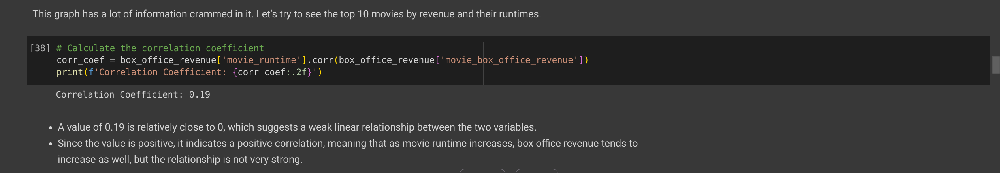
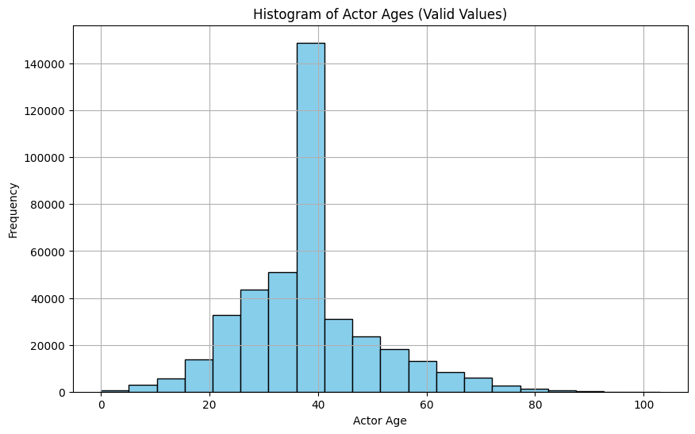

# Data Analysis on CMU Movie Summary Corpus
*By - Satvik Bajpai (U20220103)*

- [Data Analysis on CMU Movie Summary Corpus](#data-analysis-on-cmu-movie-summary-corpus)
  - [Abstract](#abstract)
  - [Data Analysis Questions](#data-analysis-questions)
    - [1. Gaining insights into the data using visualization](#1-gaining-insights-into-the-data-using-visualization)
    - [2. Is there a correlation between the sentiment of the movie and the amount of revenue it generates?](#2-is-there-a-correlation-between-the-sentiment-of-the-movie-and-the-amount-of-revenue-it-generates)
    - [3. Female Representation in movies using Bechdel Test](#3-female-representation-in-movies-using-bechdel-test)
  - [Additional Datasets](#additional-datasets)
  - [Methods and Results](#methods-and-results)
    - [Pre-Processing Methodology](#pre-processing-methodology)
    - [Getting to know our data - Answering basic questions about our data through Data Visualization.](#getting-to-know-our-data---answering-basic-questions-about-our-data-through-data-visualization)
      - [Finding Correlation between box office revenue and movie runtime](#finding-correlation-between-box-office-revenue-and-movie-runtime)
      - [Frequently occurring words (themes) in movie plots](#frequently-occurring-words-themes-in-movie-plots)
      - [Movie Genres](#movie-genres)
        - [What are the top 20 movie genres by revenue?](#what-are-the-top-20-movie-genres-by-revenue)
      - [Movie Language](#movie-language)
      - [Box Office Revenue](#box-office-revenue)
      - [Movie Runtime](#movie-runtime)
      - [Actor Age](#actor-age)
      - [Most common character names](#most-common-character-names)
  - [Bechdel Test - Gender Representation](#bechdel-test---gender-representation)
    - [*Q.* Is there a correlation between the number of female actors starring in a movie vs. whether the movie will pass the Bechdel test or not?](#q-is-there-a-correlation-between-the-number-of-female-actors-starring-in-a-movie-vs-whether-the-movie-will-pass-the-bechdel-test-or-not)
    - [*Q.* Is there a correlation between the gender of the director of the movie vs whether the movies passes the Bechdel Test or not?](#q-is-there-a-correlation-between-the-gender-of-the-director-of-the-movie-vs-whether-the-movies-passes-the-bechdel-test-or-not)
    - [*Q.* Do Bechdel Test Ratings differ across different genres of the movies?](#q-do-bechdel-test-ratings-differ-across-different-genres-of-the-movies)
    - [Cool Graph](#cool-graph)
  - [Movie plot sentiment analysis](#movie-plot-sentiment-analysis)
    - [*Q.* Is there a correlation between the sentiment of the movie and the amount of revenue it generates?](#q-is-there-a-correlation-between-the-sentiment-of-the-movie-and-the-amount-of-revenue-it-generates)
  - [Acknowledgement](#acknowledgement)
  - [References](#references)

## Abstract
This report analyzes the CMU Movie Summary Dataset from Carnegie Mellon University to gain insights into various aspects of the film industry. Data visualization techniques are employed to explore relationships between movie attributes like runtime, revenue, genres, and language. The Bechdel test, which evaluates gender representation in movies, is used to investigate the impact of factors like the number of female actors and the director's gender on passing the test criteria. Sentiment analysis is performed on movie plot summaries to examine potential correlations between sentiment polarity and box office revenue. The analysis reveals interesting findings, such as a positive correlation between the number of female actors and passing the Bechdel test, as well as differences in Bechdel ratings across genres. However, there appears to be a weak relationship between movie sentiment and revenue. The report provides a comprehensive data-driven exploration of various aspects of the movie industry, highlighting the importance of representation and contributing to a better understanding of industry trends and dynamics.

## Data Analysis Questions

### 1. Gaining insights into the data using visualization

### 2. Is there a correlation between the sentiment of the movie and the amount of revenue it generates?

### 3. Female Representation in movies using Bechdel Test
   - 3.1 Are movies with greater number of female actresses more likely to pass the Bechdel Test?
   - 3.2 Are movies directed by female directors more likely to pass the Bechdel test?
   - 3.3 How do Bechdel Test Ratings differ across different genres of the movies?

## Additional Datasets

1) https://www.cs.cmu.edu/~ark/personas/ - CMU Movie Dataset (The OG Dataset)
2) https://github.com/epfl-ada/ada-2023-project-sugarpandaddies5/blob/main/data/df_bech_with_wikiID.csv - This dataset consists of the movies considered under bechdel test combined with their wikipedia IDs so that we can work in conjunction with the CMU movie dataset 
3) https://bechdeltest.com/ - This is the Bechdel Test Dataset.
4) https://github.com/epfl-ada/ada-2023-project-sugarpandaddies5/blob/main/data/all_directors_gender.csv - This dataset consists of the movies and the information about their directors. 

## Methods and Results

### Pre-Processing Methodology

The first step was to clean the CMU movie data by doing some pre-processing.

- Finding the null values in the movie_metadata 

- Removing columns and rows with more than 50% null values

- Apart from this I also converted all the values in `movie_release_date` to `datetime` values, and converted the movie genres, countries and languages to lists by extracting the value from the dictionary they were stored in. I also converted all the fields with string data to lower case to ensure uniformity.

Similary, I also cleaned the `character_metadata` and `plot_summaries` dataframe. Please check the code for more details.

### Getting to know our data - Answering basic questions about our data through Data Visualization.

#### Finding Correlation between box office revenue and movie runtime

1. Movie runtime vs. Box Office Revenue was first plotted. 

**Observation:** 
Most movies have a runtime of under 400 minutes. One movie has a runtime of more than 1000 minutes. Upon some more probing, it was found that the movie being talked about here was `Rebound` and had a runtime of 1003 minutes. After a quick Google Search, it was found that the movie runtime was actually 103 minutes and this was an error in reporting the data. So, I corrected the data entry in the code.

2. Finding the runtime of the Top-10 highest grossing movies.

**Observation:**
`Avatar` is the highest grossing movie available on the CMU movie dataset. 

It was observed that the top 10 movies have an average runtime of about `125.14 minutes`. However, to be certain if runtime and revenue had a correlation I calculated the correlaton coefficient between them.

Movie Runtime and Box Office Revenue have only a weak correlation.

#### Frequently occurring words (themes) in movie plots

- In order to answer this question, I first plotted a wordcloud of the summaries of all the movies.

    **Note:** Wordcloud includes a list of 192 stopwords by default.
  

**Observation:**
Based on the word cloud, we can see commonly occurring words in movie plots. However, I focused on the top-100 words instead. So, some more analysis was done.

- Top 100 words in movie plots. While calculating this, we had to exclude stopwords as quite naturally the most common word including the stopwords came out to be `the`. For more details, kindly check out the code.

**Top 50 Words in movie plots (without stopwords)**

**Observation:**
The top 50 words in movie plot summaries provide insights into the common themes, characters, and actions found in these plots.

1. **Common Themes**:
   - Words like "love", "family", "life", "death", "friendship", and "money" suggest that many plot summaries revolve around universal themes and human experiences.

2. **Character Types**:
   - "Man", "woman", "father", "mother", "son", "daughter", "brother", "friend", and "police" indicate the presence of various character types central to many plots.

3. **Actions and Events**:
   - "Tells", "finds", "takes", "help", "goes", "tries", "begins", "comes", "decides", "kills", "meets", "escapes", "returns", "asks", "falls", "works", "arrives", "fights", "head", "dies", "leaves", "asks", "sees", "wants", "gives", and "killed" highlight common actions, decisions, and events that drive the plot forward.

4. **Settings and Locations**:
   - "Home", "house", "town", "city", and "room" suggest various settings where the events of the plot unfold.

5. **Conflict and Resolution**:
   - Words like "fight", "escape", "dead", "kill", and "fall" hint at the presence of conflicts, obstacles, and resolutions within the plots.

#### Movie Genres

- First, I am plotting the top 20 movies genres by count.

- Also, finding the least popular movie genres.

  
**Observation:**
We can see that drama is the most popular genre in the CMU movie corpus dataset.

##### What are the top 20 movie genres by revenue?

**Observation:**
Although, drama is the top genre when it comes to count, when it comes to mean revenue `Coming of age films` have the highest average revenue. This is an interesting observation as drama does not even appear in the top 20 movie genres by revenue. I think that says a lot about Quality vs. Quantity.

#### Movie Language

**Observation:**
English movies are the most common when it comes to count, followed by Hindi!

#### Box Office Revenue

**Observation:**
It can be observed that movie revenue has increased over the years. A fall can be seen around 2016, since complete data for the year 2016 is not available.

#### Movie Runtime

**Observation:**
This is movie runtime over the years. There has not been significant shifts in movie runtime over the past ~100 years.

#### Actor Age

- While making plots here, it was observed that plots were heavily skewed. Upon further probing, I found that some of the character age values were in fact, negative! Again errors in data reporting.

So, I am plotting only the actor ages that are positive.

Now, I was interested in finding the actor distribution over genres by age. I thought a stacked bar plot would be perfect for this. Here are the results:

**Observation:**
Maximum number of actors were observed in the 35-40 age group. Over the age, the genre patterns have some visible variations. This might be an interesting question to explore. However, we won't dive any deeper into this question.

#### Most common character names

In order to do this, I first had to remove the titles from the character name like `Mr/Mrs/Dr`, etc. as the word cloud was suggesting those are the most frequent names. I also had to ignore the `Unknown` entry which was my default value for character names that were missing.

Names like John, Tom, Peter, Bill, etc. are very common across the movies.

## Bechdel Test - Gender Representation

The `Bechdel Test`, or `Bechdel-Wallace Test`, sometimes called the `Mo Movie Measure` or `Bechdel Rule` is a simple test which names the following three criteria: 

(1) it has to have at least two women in it, who 

(2) who talk to each other, about 

(3) something besides a man. 

A work of fiction passing or failing the test does not necessarily indicate the overall representation of women in the work. Instead, the test is used as an indicator for the active presence (or lack thereof) of women in fiction, and to call attention to gender inequality in fiction.

This image from Alison Bechdel's comic is considered to be the origin of the Bechdel Test.

- A comparison of the datasets for number of movies. CMU data has many more movies in it.

**Bechdel Test Rating Over the Years**

**Bechdel Test Pass vs Fail  Over the Years**

**Rating Proportion - Top 20 Genres**

### *Q.* Is there a correlation between the number of female actors starring in a movie vs. whether the movie will pass the Bechdel test or not?

**Distribution of female actor proportions in movies**

Some very interesting insights, movies with less than 2 female actors are more likely to fail the Bechdel test according to observations from this data.

Around 80% movies having more than 2 female characters pass the Bechdel Test. 

We can clearly observe based on this screenshot, that as the number of women actors in the movie increase, the likelihood of passing the Bechdel Test also increases! A strong positive correlation of 0.73 is observed between the number of female actors and the movie passing the bechdel test.

Therefore, we can say we have successfully answered this question. For more plots and analysis, refer to the notebook.

### *Q.* Is there a correlation between the gender of the director of the movie vs whether the movies passes the Bechdel Test or not?

Interesting question. For this question we are using the director dataset obtained from `sugarpandaddies` on GitHub. Refer to datasets section for more information.

Only 5.6% movies have been directed by women! :(

There is higher proportion of movies passing the Bechdel test among women as compared to men.

Verifying this by calculating the correlation coefficient.

### *Q.* Do Bechdel Test Ratings differ across different genres of the movies?

Yes, the ratings do differ across different genres. Genres like action/adventure/thriller have historically been more likely to fail the Bechdel Test as compared to other genres.

### Cool Graph
I also made a cool graph using networkx to visualize movie genres and bechdel test ratings. This is a bipartite graph, where one set of nodes represents movies, and the other set represents genres. I then connect a movie node to a genre node if the movie belongs to that genre, and use the Bechdel test rating as an attribute for the movie nodes.

## Movie plot sentiment analysis

I first passed all the plot summaries of the movies through a NLP pipeline and made a new column called `Processed Summaries` in the dataframe. Using this column I then conducted sentiment analysis of the plots using Vader Sentiment. The scores are as follows: 

### *Q.* Is there a correlation between the sentiment of the movie and the amount of revenue it generates?

The mean revenue of movies with negative sentiment is more than movies with positive sentiment. Strange observation. However, mean is not a robust statistic and this might be due to the presence of outliers.

I then moved on to plot the distribution of the revenue across the sentiments. 

In order to get more robust statistics, I then plotted a box plot.

As suspected, the negative sentiment movies have a lot of outlier values which pump up their average revenue. The robust statistics given by box plot show a very weak effect of the movie sentiment on the revenue earned by the movie. Let's verify this further by calculating the correlation coefficient as well

Although the mean bar plot suggests otherwise, there is very weak correlation between a movie having a negative sentiment vs. the movie earning greater revenue. This is probably due to the presence of some outliers for the negative sentiment movies.

## Acknowledgement

I would like to thank the authors of the following repositories for helping me find interesting research questions and for providing helpful insights. I followed these repositories extensively and they greatly helped me.

1. https://github.com/Tachi-67/ada-2022-project-alldatapointaccurate/tree/main

2. https://github.com/epfl-ada/ada-2023-project-sugarpandaddies5

A special thanks to **Prof. Pankaj Pansari** and our amazing TAs **Ankita Ma'am** & **Sakshi Ma'am**.

## References

1. https://claude.ai
2. https://www.cs.cmu.edu/~ark/personas/
3. https://www.kaggle.com/datasets/treelunar/bechdel-test-movies-as-of-feb-28-2023
4. https://chatgpt.com/
5. https://perplexity.ai/
6. https://www.analyticsvidhya.com/blog/2022/07/sentiment-analysis-using-python/
7. https://en.wikipedia.org/wiki/Bechdel_test
8. https://www.analyticsvidhya.com/blog/2021/06/vader-for-sentiment-analysis/
9. https://stackoverflow.com/questions/52588552/google-co-laboratory-notebook-pdf-download
10. https://github.com/epfl-ada/ada-2023-project-thewestbobers/tree/main/images
11. https://github.com/epfl-ada/ada-2023-project-badafixm01/tree/main/src
12. https://github.com/pankajpansari